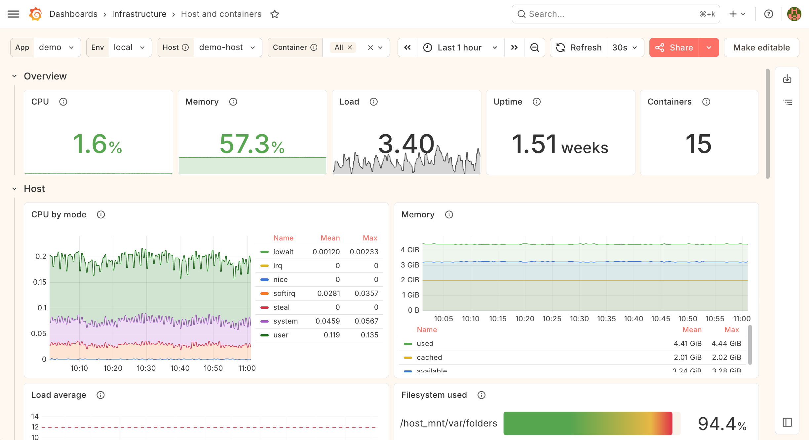
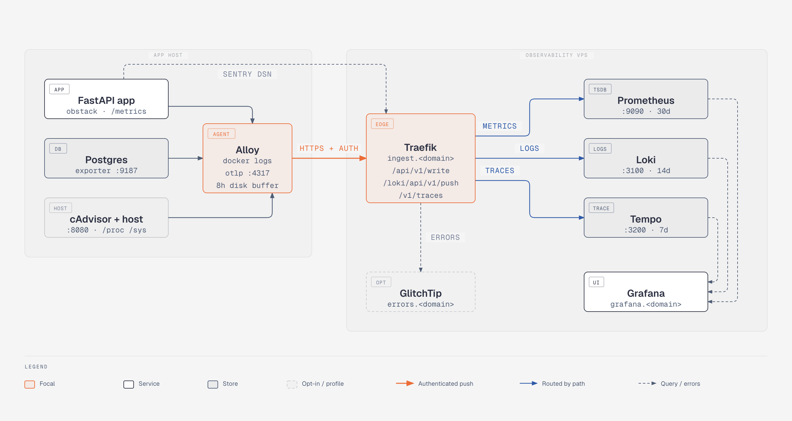

<div align="center"><a href="https://donate.unrwa.org/int/en/general"></a></div>

# 🔭 Observability Stack

<p align="center">
An application-independent Grafana LGTM stack. One deployment on a VPS serves every project.
</p>

<p align="center">
  <picture>
    <source media="(prefers-color-scheme: dark)" srcset="./docs/screenshots/grafana_dark.png">
    
  </picture>
</p>

<p align="center">
    
    
    
    
    
    
</p>

<p align="center">
    <a href="https://github.com/atick-faisal/observability-stack/actions/workflows/ci.yml"></a>
    <a href="https://github.com/atick-faisal/observability-stack/releases"></a>
    <a href="https://github.com/atick-faisal/observability-stack/issues"></a>
    <a href="https://github.com/atick-faisal/observability-stack/blob/main/LICENSE"></a>
    <a href="https://atick-faisal.github.io/observability-stack/"></a>
</p>

<picture>
  <source media="(prefers-color-scheme: dark)" srcset="./docs/diagrams/architecture-dark.png">
  
</picture>

Onboarding a new FastAPI + Postgres app is four steps: copy `agent/`, add a few Docker labels,
`uv add obstack`, one function call.

## ✨ What You Get

* 📊 **Metrics, logs and traces** — Prometheus, Loki and Tempo behind one Grafana, all three
  carrying the same identity labels so you can jump between them
* 🔐 **One authenticated ingest host** — `ingest.<domain>` exposes three paths and nothing else
  is reachable from outside
* 🏷️ **Docker-label discovery** — the agent finds scrape targets and log streams from labels; no
  per-app agent config
* 💾 **Outage-proof** — the agent buffers all three signals to disk and replays them with their
  original timestamps
* 🐍 **A four-step SDK** — `obstack` wires up a FastAPI app in one call
* ✅ **Verified, not assumed** — `make verify-signals` / `verify-dashboards` / `verify-resilience`
  fail the build rather than a graph three months later
* 🐛 **Opt-in error tracking** — GlitchTip, separate so a metrics-only stack doesn't pay for it

> [!IMPORTANT]
> Read [`docs/labels.md`](./docs/labels.md) first. The four identity labels — `app`, `service`,
> `env`, `host` — are the contract everything else depends on. If any other document disagrees
> with it, that one wins.

## 🏗️ The Two Halves

Both are deployable independently.

**Server** — Traefik fronts Grafana and GlitchTip (`compose.glitchtip.yml`) on public subdomains, plus a single
`ingest.<domain>` host exposing three authenticated paths that proxy to Prometheus
remote-write, Loki push, and Tempo OTLP/HTTP. Nothing else is reachable from outside.

**Agent** — one Alloy container per app host. It discovers scrape targets and log streams from
Docker labels, runs optional cAdvisor / postgres-exporter via Compose profiles, receives OTLP
traces from the local app, and pushes everything to `ingest.<domain>` over HTTPS with basic
auth and local buffering. The app exposes nothing publicly.

**`compose.lgtm.yml` on its own is the deployed shape**: nothing published, each service
building a small image with its config baked in, and Traefik routing driven by container
labels. That is what a deploy points at. Set `OBS_EDGE_NETWORK` / `OBS_EDGE_EXTERNAL` to
put it behind a proxy the host already runs, or add `compose.edge.yml` to bring your own.
Publishing no port is deliberate: it is what stops the authenticated ingest path from
being optional.

## 🚀 Quickstart

```bash
cp .env.lgtm.example .env.lgtm   # set GF_ADMIN_PASSWORD and OBS_DOMAIN

make help          # list targets
make lgtm-up       # start the LGTM stack
make demo-up       # start the local end-to-end demo (app + db + loadgen)
make verify-signals   # assert every signal arrives, with the label contract intact
make verify-dashboards   # assert every panel on every dashboard has data
```

> [!TIP]
> `make lgtm-up` adds `compose.lgtm.local.yml`, which publishes Grafana `:3000`, Prometheus
> `:9090`, Loki `:3100` and Tempo `:3200` / `:4317` / `:4318` on `127.0.0.1` and bind-mounts the
> configs so an edit takes effect without a rebuild.

Error tracking is opt-in and separate — five more containers and a second Postgres, which
a stack that only wants metrics, logs and traces should not pay for:

```bash
cp .env.glitchtip.example .env.glitchtip   # set SECRET_KEY and POSTGRES_PASSWORD
make glitchtip-up                          # GlitchTip on 127.0.0.1:8001, errors.<domain> via Traefik
./scripts/verify-errors.sh --bootstrap     # mint an organisation, a project and a DSN
OBS_ERROR_DSN=<the printed DSN> make demo-up
make verify-errors                         # assert /boom becomes an issue, correctly tagged
```

## 📦 Onboarding an App

```yaml
# 1. copy agent/ into the app repo as observability/, then label the containers
services:
  api:
    labels:
      obs.service: api
      obs.metrics.port: "8000"
      obs.metrics.path: /metrics
    expose:
      - "8000"          # the port has to be exposed; publishing it is not needed
```

```bash
# 2. run the agent alongside the app
docker compose -f compose.lgtm.yml -f observability/compose.agent.yml up -d

# 3. add the SDK
uv add "obstack[grpc,sqlalchemy]"
```

```python
# 4. wire it up
from obstack import setup_observability

setup_observability(app, engine=engine)
```

## 🧯 Surviving an Outage

The agent buffers all three signals to disk and replays them with their original timestamps, so
a VPS that is down for a while leaves a continuous line rather than a hole.

> [!WARNING]
> Each buffer has a server-side window that has to be at least as generous — see the table in
> [`agent/README.md`](./agent/README.md). A replay the server rejects as too old is worse than no
> buffer at all: it looks like it worked.

```bash
make verify-resilience   # stops the server for 15 min, asserts no gap in any signal
```

## 💾 Backup & Restore

```bash
make backup                                   # grafana.db + GlitchTip's database
make backup ARGS="--all --keep 7"             # ...plus the three TSDBs, keeping the newest 7
make restore DIR=backups/<stamp>              # dry run: prints what it would replace
make restore DIR=backups/<stamp> ARGS=--yes   # and now for real
```

> [!CAUTION]
> `make restore` is a dry run until you add `ARGS=--yes`. Read what it prints before you do.

Dashboards are files in git, so the irreplaceable state is smaller than it looks: `grafana.db`
(the admin account, users, annotations, alert state) and GlitchTip's Postgres. Those two are the
default set. The TSDBs are opt-in — they are retention-bounded and 25 GB-capped, and a routine
backup should not be tens of gigabytes. Each is copied the way its storage engine allows rather
than all three the same way; `scripts/backup.sh`'s header says which and why.

## 📊 Dashboards

Grafana comes up with all three datasources and the `Applications` / `Databases` /
`Infrastructure` folders already provisioned. They are read-only by design — dashboards
are files in git, not UI state.

Which is why `make verify-dashboards` exists: an expression that returns nothing renders as
an empty graph, indistinguishable from a quiet period, and a dashboard nobody can edit in the
browser is a dashboard nobody notices has gone blank. It runs every panel's query against the
demo and fails on any that comes back empty, so a rename in `docs/labels.md` breaks the build
rather than a graph three months later.

## 📚 Documentation

All of it is on the [documentation site](https://atick-faisal.github.io/observability-stack/),
and in this repo:

| | |
|---|---|
| [`docs/labels.md`](./docs/labels.md) | **Read this first.** The label contract everything else depends on. |
| [`sdk/obstack/README.md`](./sdk/obstack/README.md) | The Python SDK: settings, metric names, what one call gets you. |
| [`agent/README.md`](./agent/README.md) | The agent: labels to add, what it collects, what will bite you. |
| [`demo/`](https://github.com/atick-faisal/observability-stack/tree/main/demo) | A worked example of the four steps above — copy it when onboarding. |
| [`docs/onboard-app.md`](./docs/onboard-app.md) | The four-step diff in detail. |
| [`docs/deploy-server.md`](./docs/deploy-server.md) | Provisioning, DNS, first `up`, clock sync. |
| [`docs/local-dev.md`](./docs/local-dev.md) | The demo stack, the verify scripts, macOS caveats. |
| [`docs/operations.md`](./docs/operations.md) | Retention, backup/restore, cardinality, upgrades. |

<p align="center">
  
</p>

<p align="center">
  <a href="https://sites.google.com/view/mchowdhury" target="_blank">Qatar University Machine Learning Group</a>
</p>

<p align="center">
  <a href="https://github.com/atick-faisal/observability-stack/blob/main/LICENSE">
    
  </a>
</p>
